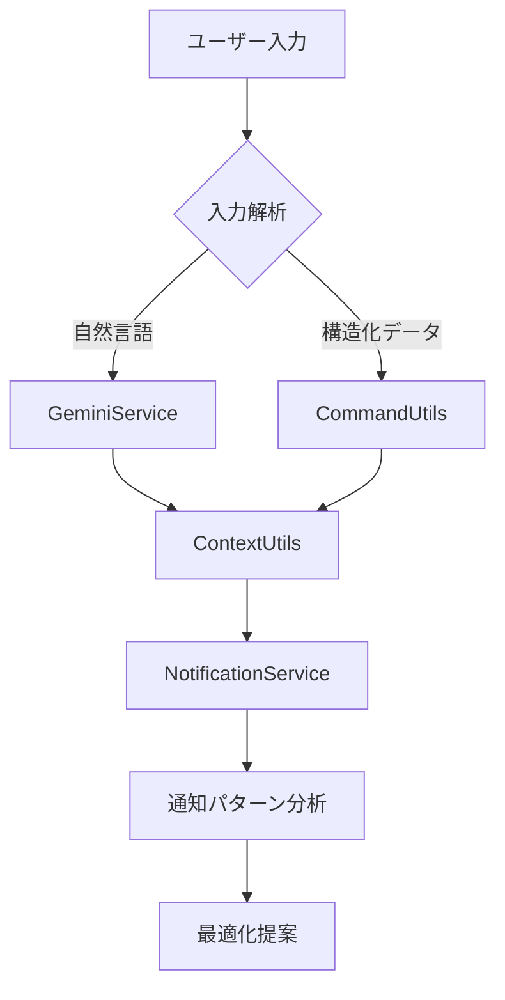

# 高度通知機能実装計画書

## 1. 実装概要
既存の通知システムを拡張し、以下の高度な機能を追加します：
- 文脈を考慮したリマインダー最適化
- 自然言語による柔軟なリマインダー設定
- 類似通知パターンの自動分析・提案

## 2. アーキテクチャ設計



### 2.1 主要コンポーネント拡張
- `services/notification/notification_service.py`
  - 新しいメソッド追加：
    - `analyze_notification_patterns()`
    - `optimize_reminder_based_on_context()`
    - `process_natural_language_input()`

- `utils/context_utils.py`
  - 会話履歴分析機能強化：
    - `analyze_conversation_context()`
    - `extract_user_preferences()`

- `services/gemini_service.py`
  - NLP処理拡張：
    - `enhance_natural_language_processing()`

## 3. 詳細実装手順

### 3.1 自然言語処理統合
```python
# services/gemini_service.py
class GeminiService:
    def parse_natural_language(self, text: str) -> dict:
        """
        自然言語の通知リクエストを解析
        """
        prompt = f"""
        以下のテキストから通知設定を解析してください：
        {text}

        出力形式：
        - 日時
        - 繰り返しパターン
        - 優先度
        - 関連キーワード
        """
        return self._process_prompt(prompt)
```

### 3.2 文脈分析拡張
```python
# utils/context_utils.py
class ContextUtils:
    def analyze_conversation_flow(self, user_id: str) -> dict:
        """
        会話の流れからユーザーの意図を推定
        """
        contexts = self.get_recent_contexts(user_id)
        analysis_result = {
            "common_themes": self._detect_common_themes(contexts),
            "temporal_patterns": self._identify_temporal_patterns(contexts),
            "priority_keywords": self._extract_priority_keywords(contexts)
        }
        return analysis_result
```

### 3.3 通知パターン分析
```python
# services/notification/notification_service.py
class NotificationService:
    def analyze_patterns(self, user_id: str) -> list:
        """
        類似通知パターンを分析
        """
        notifications = self.get_notifications(user_id)
        patterns = []
        
        # 時系列パターン分析
        time_patterns = self._analyze_time_distribution(notifications)
        
        # コンテンツ類似性分析
        content_similarity = self._calculate_content_similarity(notifications)
        
        # 優先度トレンド分析
        priority_trends = self._identify_priority_trends(notifications)
        
        return {
            "time_patterns": time_patterns,
            "content_similarity": content_similarity,
            "priority_trends": priority_trends
        }
```

## 4. データモデル拡張
```python
# services/notification/notification_model.py
class Notification:
    def __init__(self, ...):
        # 既存フィールドに追加
        self.context_metadata = {
            "related_keywords": [],
            "conversation_context": {},
            "optimization_history": []
        }
        
    def add_optimization_record(self, optimization_data: dict):
        """
        最適化実施記録を追加
        """
        self.context_metadata["optimization_history"].append({
            "timestamp": datetime.now(),
            "details": optimization_data
        })
```

## 5. 実装リスクと対応策

| リスク要因 | 影響度 | 対応策 |
|------------|--------|--------|
| NLP解析精度不足 | 高 | 多段階フォールバック機構を実装 |
| パフォーマンス低下 | 中 | 非同期処理とキャッシュを導入 |
| データ整合性問題 | 高 | トランザクション管理とバージョニングを強化 |

## 6. テスト計画

### 6.1 単体テスト
- 自然言語解析精度テスト
- 文脈分析ロジック検証
- パターン分析アルゴリズム検証

### 6.2 統合テスト
```python
# テストシナリオ例
def test_end_to_end_flow():
    # 自然言語入力
    user_input = "明日の会議の30分前にもう一度通知して"
    
    # 解析処理
    parsed = gemini_service.parse_natural_language(user_input)
    
    # 文脈分析
    context = context_utils.analyze_conversation_flow(user_id)
    
    # 通知登録
    notification = notification_service.create_notification(
        user_id, parsed, context
    )
    
    # パターン分析
    patterns = notification_service.analyze_patterns(user_id)
    
    assert notification.optimized == True
    assert len(patterns) > 0
```

## 7. 移行計画
1. 段階的導入フェーズ
2. シャドウモードでの動作検証
3. ユーザーフィードバックループの構築
4. フルスケール移行

## 8. パフォーマンス最適化
- **非同期処理の導入:**
  - CeleryまたはRQを使用して、時間のかかる処理（例：Gemini APIの呼び出し、パターン分析）をバックグラウンドで実行します。
- **キャッシュ戦略:**
  - Redisなどのキャッシュシステムを使用して、頻繁にアクセスされるデータ（例：ユーザー設定、通知パターン）をキャッシュします。
- **バッチ処理による分析処理:**
  - 通知パターン分析などの処理をバッチ処理化し、システム負荷を軽減します。

## 9. セキュリティ対策
- **機密データの暗号化:**
  - 通知データやAPIキーなどの機密情報を暗号化して保存します。
- **アクセス制御の強化:**
  - APIエンドポイントへのアクセスを制限し、不正アクセスを防止します。
- **監査ログの実装:**
  - ユーザー操作やシステムイベントを記録し、セキュリティインシデント発生時に追跡できるようにします。

## 10. 今後の拡張性
- **機械学習モデルのプラグイン化:**
  - 通知最適化やパターン分析に利用する機械学習モデルをプラグイン化し、柔軟にモデルを切り替えられるようにします。
- **マルチモーダル入力対応:**
  - テキストだけでなく、音声や画像などのマルチモーダルな入力に対応できるようにします。
- **クロスプラットフォーム通知連携:**
  - LINEだけでなく、他のプラットフォーム（例：Slack, Discord）への通知連携を可能にします。

## 11. テスト計画 (詳細)

### 11.1 統合テスト (詳細)
- **テストケース1:**
  - 自然言語入力: 「明日の朝7時に会議の通知」
  - 検証項目: 通知が正しく登録され、通知時刻が正しく設定されること
- **テストケース2:**
  - 自然言語入力: 「毎日18時に夕食の準備」
  - 検証項目: 定期的な通知が正しく登録され、繰り返し設定が正しく設定されること
- **テストケース3:**
  - 自然言語入力: 「来週の月曜日に病院の予約」
  - 検証項目: 日付指定のある通知が正しく登録されること
- **テストケース4:**
  - 自然言語入力: 「3時間後に会議」
  - 検証項目: 相対的な時間指定の通知が正しく登録されること
- **テストケース5:**
  - 自然言語入力: 「明日の朝7時に会議の通知」を登録後、「会議の時間を1時間遅らせて」
  - 検証項目: 通知時刻が正しく変更されること
- **テストケース6:**
  - 自然言語入力: 「明日の朝7時に会議の通知」を登録後、「この通知は重要」
  - 検証項目: 通知の優先度が正しく変更されること
- **テストケース7:**
  - 自然言語入力: 「明日の朝7時に会議の通知」を登録後、「明日の朝7時に打ち合わせの通知」
  - 検証項目: 類似通知が検出されること

## 12. 実装リスクと対応策 (詳細)
- **NLP解析精度不足:**
  - 多段階フォールバック機構を実装し、Gemini APIの解析結果が不十分な場合は、スマート時間解析やデフォルト設定を使用します。
- **パフォーマンス低下:**
  - 非同期処理とキャッシュを導入し、API呼び出しやデータ処理の負荷を軽減します。
- **データ整合性問題:**
  - トランザクション管理を強化し、通知データの整合性を保ちます。また、データバージョニングを導入し、データの変更履歴を追跡できるようにします。